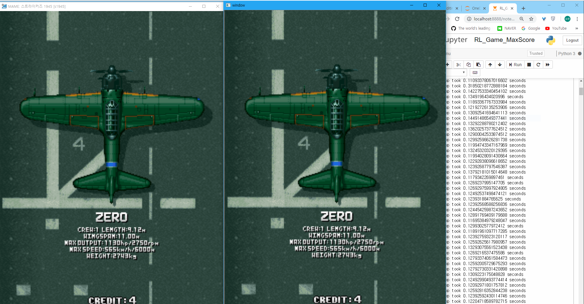

# RL_Reinforcement_Learning
Learn how to get the maximum score for a game using RL

이 project에서는 game의 화면을 CNN으로 feature를 추출하여 state를 만들고 이를 바탕으로 강화학습을 하여 Max score를 얻는 것을 목적으로 한다.
Project에 사용될 game은 'strikers 1945' shooting game으로 내가 잘 못 하는 shooting game을 인공지능이 학습하여 더 잘하는 모습을 보고 싶기 때문이다.
game 실행은 Mame Emulator로 strikers 1945 Rom으로 실행한다.

## 0. 환경
* ~~Game 실행 후 기체 선택까지는 내가 해주기(굳이 이 부분까지 학습할 필요는 없다.)~~ 내 개입 없이 자동으로 학습할 수 있도록 game이 끝나면 혼자 다시 시작하도록 한다. ~~(학습은 아니고 game 종료가 되었을 때 count down이 된다. 이를 빨리 넘기고 기체 선택까지 행동할 command를 미리 내가 입력해두고 실행하게 한다)~~ ~~Emulator에 game soft reset을 사용하여 infinite coin cheat는 유지하며 game 초기화면으로 돌아간다. 그 후 정해진 command를 입력하여 기체 선택까지 하도록 한다.~~ 상태 저장하는 기능이 있더라. 기체 선택 후 맨 처음을 save해 놓고 죽으면 load하면 된다.
* 학습을 위해 기체는 Bf-109 하나로 통일하기(선택이유: 유도 미사일이 있어 더 쉽게 game을 진행할 수 있을 것 같아서) 
* 죽어도 계속 continue 해버리면 이전 판의 reward에 누적되므로 바로 죽어도 높은 reward를 얻게 된다. 다시 처음부터 시작하자
* 강화학습의 특성상 reward 받는 term이 짧을수록 좋은데 다행히 이 game은 실시간으로 reward를 얻을 수 있다. 
* 원래 game에서는 목숨이 3개가 있지만 학습을 편하게 하기 위해 목숨을 1로 바꿔준다
* ~~cheat 중에 무한 credit을 적용(동전 넣는 command가 필요 없다)~~ 상태 load로 필요 없다.
* ~~game 특성 상 stage가 정해져 있지 않고 시작할 때마다 random하게 바뀐다. general하게 학습하기 좋다~~ 상태 load로 항상 초기 상태 일정하게 유지된다.

## 1. 데이터 얻기
학습을 위해서는 data가 필요하다. 하지만 실행하는 game의 정보를 어떻게 얻을 것인가?
Open AI에서는 Gym을 통해 다양한 ATARI Game을 환경으로 제공한다. 분명 이것을 사용하면 쉽게 만들 수 있겠으나 내가 원하는 game을 할 순 없다.
그래서 생각한 것이 직접 화면을 capture하여 data를 얻는 것이다. 앞으로 강화학습 코드 또한 python을 사용할 것이므로 python을 사용하여 내 computer의 화면을 capture하는 방법을 찾아보았다. 
OpenCV를 사용하여 해결할 수 있었다. PIL(pillow)의 ImageGrab을 이용하여 computer의 특정 영역을 Capture한다. 이 때 매개변수로 Capture 시작점 x좌표,y좌표, Capture할 영역의 길이, Capture할 길이의 높이를 넣어준다. 자동적으로 학습 과정 중 game은 창모드로 화면에 정해진 구역에 있어야 하게 된다. 화면에서 왼쪽 최상단 모서리의 좌표가 (0,0)이고 오른쪽으로 갈수록 x좌표가 커지고 아래로 갈수록 y좌표가 커지게 된다.

openCV란 Computer Vision library의 약자로 이미지 검수를 기계적으로 처리하도록 도와주는 이미지 처리 라이브러리

PIL의 ImageGrab을 사용하여 위와 같이 실시간으로 Capture할 수 있게 되었다. time을 이용하여 한 장당 걸리는 시간을 측정하니 대략 0.12초가 걸린 것을 알 수 있고 실제로 보면 조금 delay가 있는 것도 확인할 수 있었다. 이 delay 때문에 화면을 약간씩 건너뛰게 되는 효과가 나타나지만 0.12초에 화면에 그렇게 큰 변화가 일어나지 않아 영향은 적을 것이라 생각된다.

## 다음에 할 일
* image 좌상단에 고정되어 있는 reward 얻어오기(image 짤라서 숫자로 변환 어떻게?)
* Game이 끝나는 것 감지하고 다시 시작하기
* game 입력하는 방법
* Model 

참고자료
1. 논문: Playing Atari with Deep Reinforcement Learning : https://www.cs.toronto.edu/~vmnih/docs/dqn.pdf
2. 딥러닝과 강화 학습으로 나보다 잘하는 쿠키런 AI 구현하기 : https://www.slideshare.net/deview/ai-67608549
3. LG CNS 블로그- 보상을 통해 학습하는 머신러닝 기술 1편 : https://blog.lgcns.com/1692
4. LG CNS 블로그- 보상을 통해 학습하는 머신러닝 기술 2편 : https://blog.lgcns.com/1697?category=515093
5. open AI : https://openai.com/
6. open AI Gym : https://gym.openai.com/
7. Python GTA5 자동주행 : http://jhlblue.tistory.com/10
8. Reading game frames in Python with OpenCV - Python Plays GTA V :https://pythonprogramming.net/game-frames-open-cv-python-plays-gta-v/
